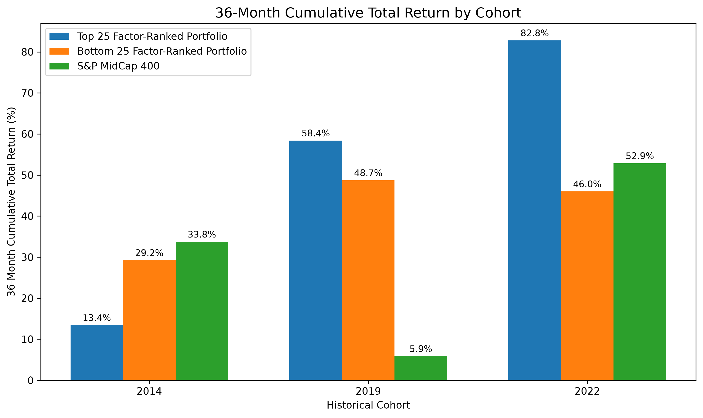
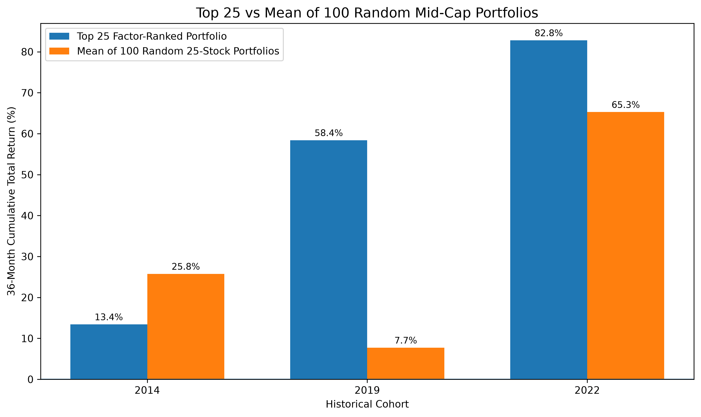

# Mid-Cap Stock Selection Factor Model | Bloomberg Terminal & Python

A point-in-time quantitative equity research project testing whether accelerating fundamentals, business quality, and growth-adjusted valuation help identify subsequent U.S. mid-cap outperformers. Bloomberg Terminal and Excel/BQL workflows support historical data preparation; Python implements company-level universe construction, factor scoring, portfolio formation, and return analysis. Three historical cohorts compare a model-selected Top 25 with random peer portfolios, the S&P MidCap 400, and the Bottom 25 over 36-month holding periods.

Jett Zillmer | B.B.A. Finance Candidate, Florida Atlantic University | Expected December 2026.

[Research notebook](notebooks/Mid_Cap_Factor_Model_Return_Focused.ipynb) · [Research report (PDF)](report/MidCapFactorResearchReport.pdf)

## Research question

Can a point-in-time factor model emphasizing accelerating fundamentals, business quality, and growth-adjusted valuation identify mid-cap stocks that subsequently outperform comparable equities over 36 months?

## Factor model

- **Growth — 50%:** revenue growth acceleration and 3-month Bloomberg forward 12-month (BF12M) EPS revision.
- **Quality — 30%:** return on invested capital (ROIC) and free cash flow margin.
- **Valuation — 20%:** BF12M PEG and growth-adjusted enterprise value / forward sales; lower values score better.

Factors are winsorized at the 1st and 99th percentiles, percentile-ranked across the scoring universe, and standardized within historical GICS sectors. A company must have at least one available factor in each pillar; available factors are equally weighted within that pillar. The composite uses the same 50/30/20 weights across cohorts. Sector normalization of scores does not impose sector-neutral portfolio weights.

## Historical cohorts and universe construction

- **2014:** formed December 31, 2014; evaluated January 2015–December 2017; 823 scored companies.
- **2019:** formed December 31, 2019; evaluated January 2020–December 2022; 810 scored companies.
- **2022:** formed December 30, 2022; evaluated January 2023–December 2025; 840 scored companies.

Historical screens cover U.S.-domiciled common stocks, including subsequently delisted securities. Market capitalization is converted to USD at screen-date exchange rates, and multiple securities are reconciled into economic companies. The mid-cap universe comprises company market-cap ranks **501–1500**, followed by a **3-month average daily trading value above $5 million** filter, without reranking. Factor-availability requirements determine the final scoring universe. Historical GICS mappings define the sector peer groups.

## Portfolio methodology and benchmarks

The 25 highest-scoring companies form the **Top 25**; the 25 lowest-scoring companies form the **Bottom 25** comparison. Both are long-only portfolios with equal 4% initial weights, held for 36 months without monthly rebalancing. Constituent monthly total returns are compounded, and constituent wealth paths are averaged to reflect buy-and-hold weight drift.

For each cohort, **100 separate random 25-stock portfolios** are drawn from the **same scoring universe**. Each draw selects 25 distinct companies without replacement; companies may recur across separate portfolios. Every portfolio is equally weighted at formation and held for 36 months without monthly rebalancing. **Random Portfolio Mean is the arithmetic mean of the 100 separate portfolio-level 36-month cumulative total returns.** Sampling uses a reproducible seed of 42 plus the cohort year.

The **S&P MidCap 400 (MID Index in Bloomberg)** provides an external mid-cap benchmark. Its monthly return series is compounded over the same 36-month windows. The random portfolios provide a comparison drawn directly from the model's own opportunity set.

## Main results

**All values below are 36-month cumulative total returns, not annualized returns.** Cohort labels indicate formation years.

| Cohort | Top 25 | Random Portfolio Mean | S&P MidCap 400 | Bottom 25 |
| --- | ---: | ---: | ---: | ---: |
| 2014 | 13.43% | 25.77% | 33.75% | 29.25% |
| 2019 | 58.40% | 7.74% | 5.87% | 48.72% |
| 2022 | 82.80% | 65.28% | 52.87% | 46.00% |

Source: finalized research results using Bloomberg Terminal data. Random Portfolio Mean summarizes 100 separate random 25-stock portfolios per cohort.





Chart labels are rounded to one decimal place; the table reports two decimal places.

## Key findings

- **2019 substantially outperformed:** the Top 25 exceeded all three comparisons and all 100 sampled random portfolios; the one-sided empirical return p-value was approximately 0.0099.
- **2022 outperformed:** the Top 25 exceeded all three comparisons and 73% of random portfolios, but its empirical p-value of 0.2772 did not indicate an unusual result within the sampled distribution.
- **2014 underperformed:** the Top 25 lagged all three comparisons and exceeded only 16% of random portfolios.

The results provide **promising but regime-dependent evidence**, rather than evidence of consistent market outperformance or proven alpha. The study evaluates the full composite and does not isolate the contribution of revenue acceleration alone.

## Limitations

Only three historical cohorts and 100 random portfolios per cohort limit statistical inference and generalization. Concentration in 25 stocks and drifting weights can amplify individual-company outcomes; the Top 25 was more volatile than the index in all three cohorts. Results exclude transaction costs, taxes, and other implementation frictions. Historical data, company deduplication, currency conversion, sector reconstruction, missing-factor treatment, and return matching introduce assumptions. Month-end drawdowns omit intramonth extremes. These comparisons do not establish persistent risk-adjusted alpha.

## Technical stack and use

**Bloomberg Terminal · Bloomberg Excel / BQL workflows · Python · pandas · NumPy · SciPy · Matplotlib · Jupyter**

Supporting notebook dependencies include openpyxl for Excel I/O, Jinja2 for styled tables, IPython for display, and yfinance for historical FX in the exploratory appendix. Install dependencies with `python -m pip install -r requirements.txt`. Versions are unpinned because the finalized notebook does not provide a locked environment.

The notebook is available for code and methodology review. Full execution requires the private inputs described in its configuration section, with the working directory set to the private research data folder. The appendix also requires private monthly snapshots and network access for historical FX. The analysis was not rerun as part of repository packaging.

## Repository structure

```text
mid-cap-factor-model/
├── README.md
├── requirements.txt
├── .gitignore
├── notebooks/
│   └── Mid_Cap_Factor_Model_Return_Focused.ipynb
├── report/
│   └── MidCapFactorResearchReport.pdf
└── figures/
    ├── chart1_36m_return_comparison.png
    └── chart2_top25_vs_random_mean.png
```

## Data availability

**Bloomberg source data are licensed/proprietary and cannot be redistributed.** Raw workbooks, security-level exports, historical snapshots, private Excel research outputs, backup notebooks, and intermediate files are excluded. The report and charts are unchanged finalized artifacts. The notebook retains its finalized code and explanatory text; saved outputs and execution counts have been cleared to remove embedded security-level data previews.

The `.gitignore` excludes private data files, local environments, and temporary outputs. Running the notebook locally can repopulate security-level notebook outputs and create private Excel exports; clear saved notebook outputs before any public commit. Aggregate findings remain available in this README, the charts, and the report.
